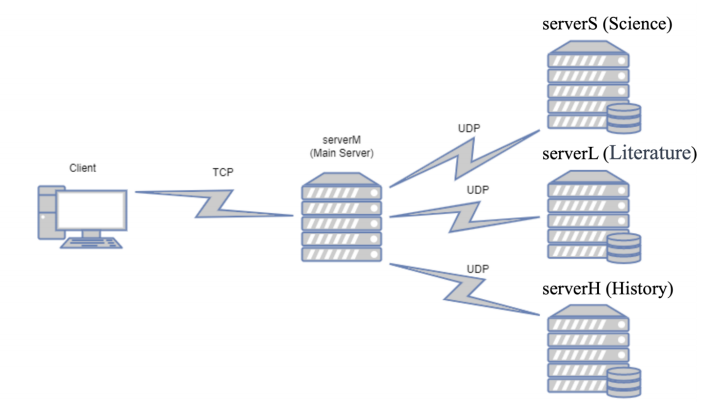
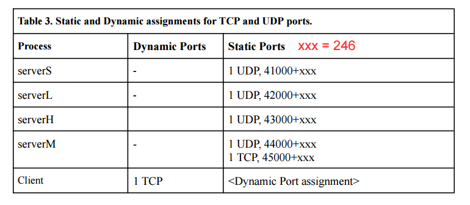

### EE450 Computer Network Project

# Library Management System - UNIX Socket Programming Project

## Problem Statement

Library Management Systems streamline library services, save time, and enhance the overall user experience. A secure, reliable, functional, and informative web registration system is essential for the library's success. This system must:

- Authenticate library members using encrypted credentials.
- Allow members to check the availability of books in three departments: Science, Literature, and History.
- Process borrowing requests securely and efficiently.

## Project Components

The system consists of the following components:

- **Client:** Used by a library member to access the registration system. Encrypts the login information.
- **Main Server (`serverM`):** Verifies the identity of members and coordinates with backend servers.
- **Department Servers (Science (`serverS`), Literature (`serverL`), History (`serverH`)):** Store the information of books offered by each department.

## Source Code Files

1. **Main Server (`serverM`):** `serverM.c`.
2. **Backend Servers (Science, Literature, History):** `server#.c`. Replace `#` with `S`, `L`, or `H` depending on the department.
3. **Client:** `client.c`.

## Input Files

- `member.txt`: Contains encrypted usernames and passwords (accessed only by the Main Server).
- `science.txt`: Contains science book inventory (accessed only by the Science Department server).
- `literature.txt`: Contains literature book inventory (accessed only by the Literature Department server).
- `history.txt`: Contains history book inventory (accessed only by the History Department server).
- `member_unencrypted.txt`: The unencrypted version of `member.txt` (for reference only).

## Phases of the Project

### Phase 1: Boot-Up

1. Start the Main Server (`serverM`), followed by the backend servers (`serverS`, `serverL`, `serverH`), and then the Client.
2. Each backend server reads its respective input file and stores the book data.
3. The backend servers send book statuses to the Main Server via UDP.
4. The Main Server maintains a list of book statuses corresponding to each backend server.

### Phase 2: Login and Confirmation

1. The client prompts the user to enter a username and password, encrypts the credentials, and sends them to the Main Server via TCP.
2. The Main Server verifies the credentials and responds to the client.

### Phase 3: Forwarding Request to Backend Servers

1. Upon successful login, the client sends a book code request to the Main Server.
2. The Main Server routes the request to the appropriate backend server based on the book code prefix (`S`, `L`, `H`) using UDP.

### Phase 4: Reply

1. The corresponding backend server checks the availability of the requested book and replies to the Main Server.
2. The Main Server forwards the reply to the client.

### Extra Credit: Inventory Management

1. Admin users can log in with credentials `Username: Admin, Password: Admin`.
2. Admins can query the total availability of books based on book codes.

## Process Flow

1. Start servers in the following order: `serverM`, `serverS`, `serverL`, `serverH`, and then the client.
2. Each server and the client should remain continuously running unless stopped manually or under specified conditions.

## Port Number Allocation

The specified port numbers for each server and client are outlined in the .pdf file guidelines.

## On-Screen Messages

Refer to the on-screen messages section of the .pdf guidlines for detailed messages to display during each phase of the project.

## Constraints

- The username will be 5-50 lowercase characters.
- The password will be 5-50 characters and case-sensitive.
- Use the specified encryption scheme: offset each character by 5; case-sensitive; special characters remain unchanged.

